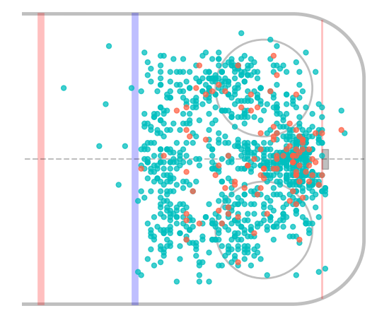

# ruskie



Needed things
---
 * [Nix](https://nixos.org/nix/)

Quick start
---
```
$ ./shell
[nix-shell:path/to/ruskie]$ ./db/main       # build Sqlite3 database
[nix-shell:path/to/ruskie]$ ./viz/main      # generate visualization
[nix-shell:path/to/ruskie]$ ./model/main    # generate XGBoost model
```
